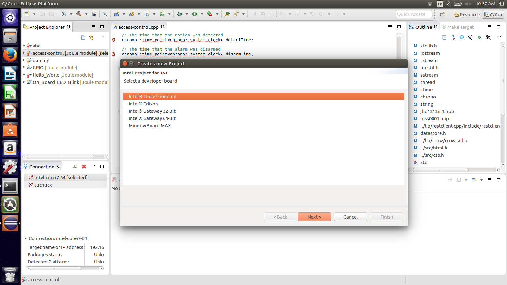
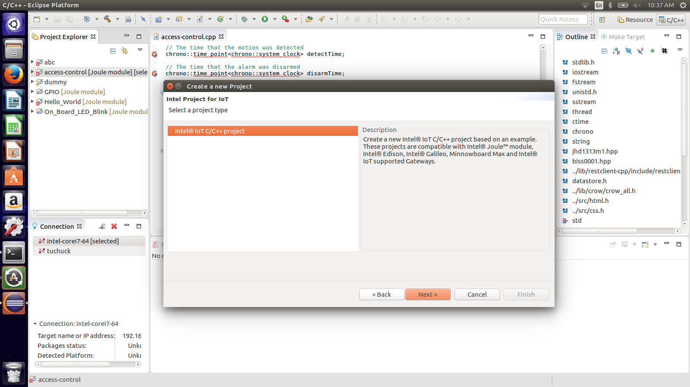
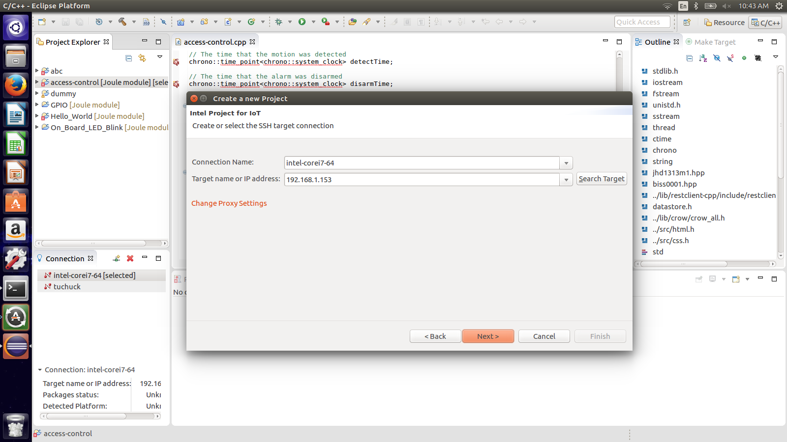
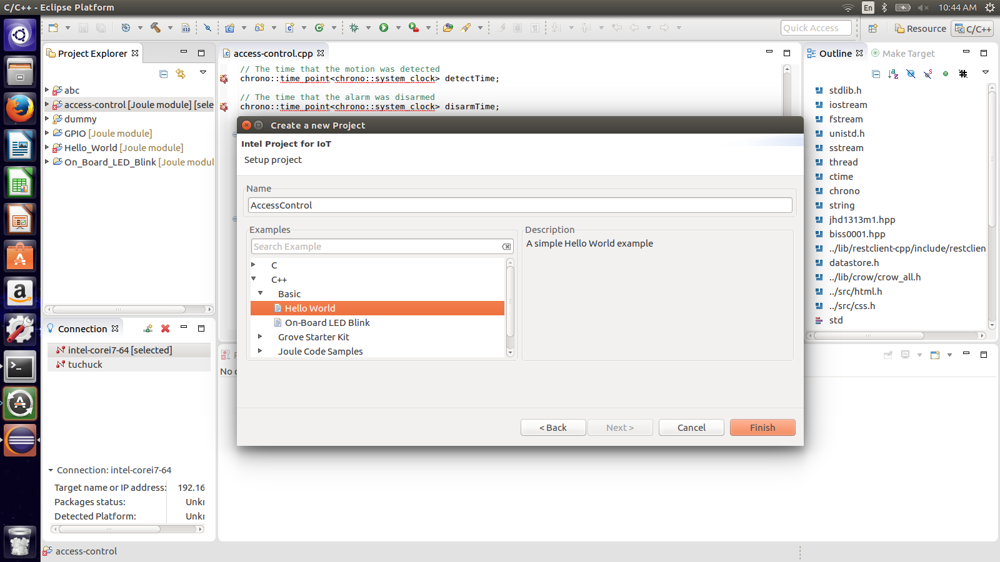
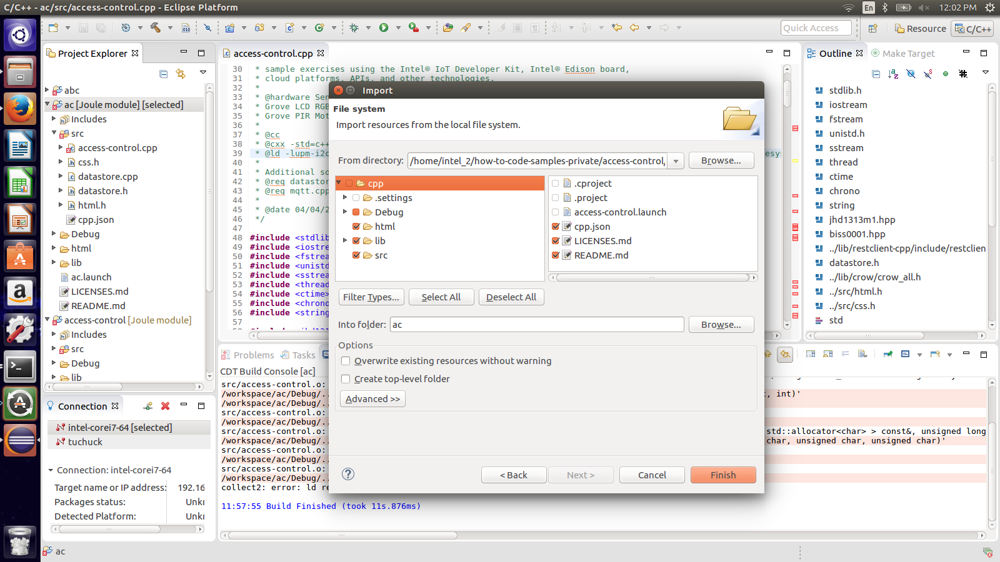
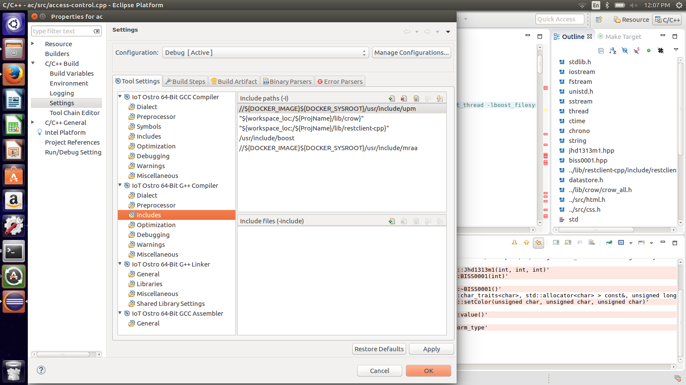
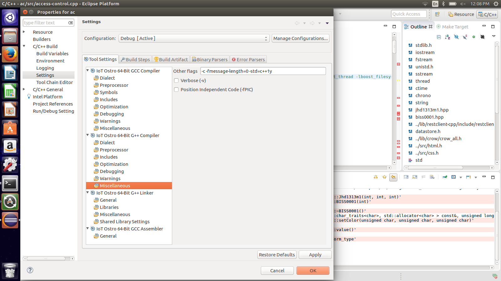
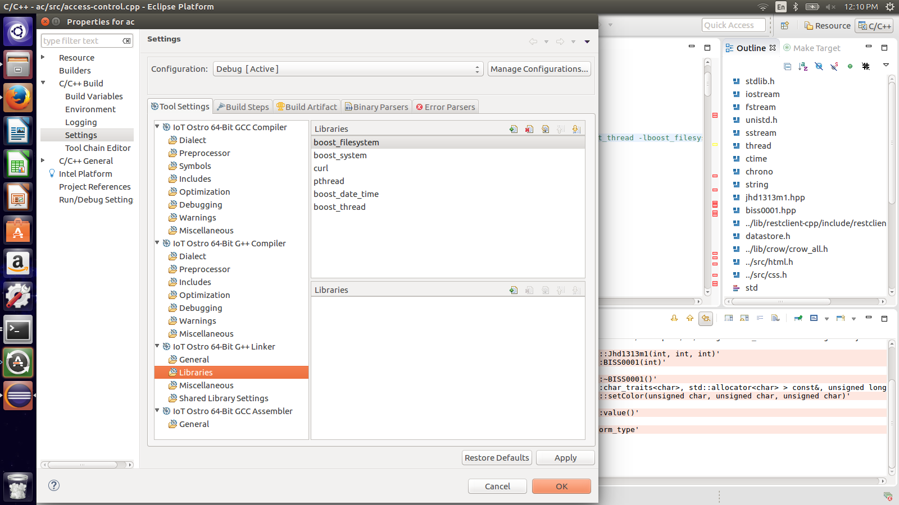
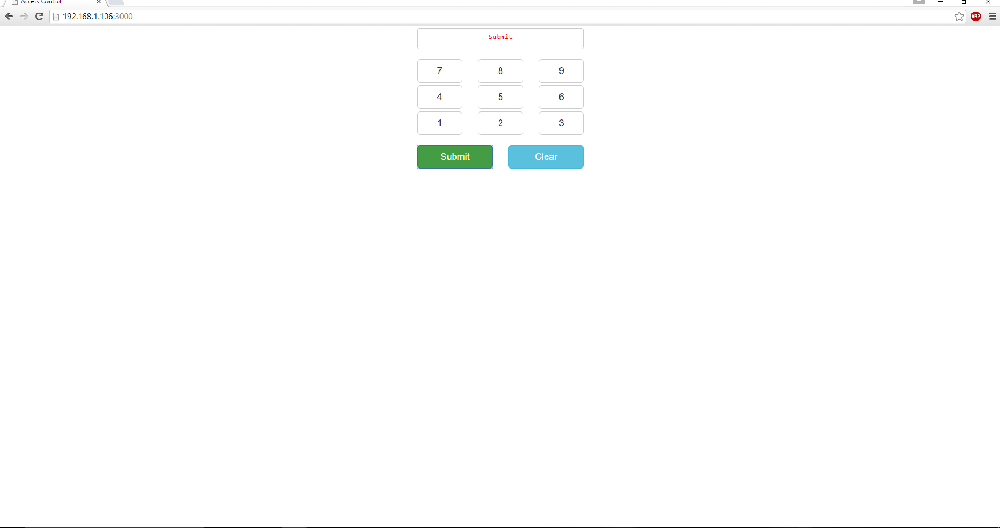

# Access control in C++

## Introduction

This access control system application is part of a series of how-to Intel® Internet of Things (IoT) code sample exercises using the Intel® IoT Developer Kit, Intel® Joule Expansion board, cloud platforms, APIs, and other technologies.

From this exercise, developers will learn how to:

- Connect the Intel® Joule Expansion board, a computing platform designed for prototyping and producing IoT and wearable computing products.
- Interface with the Intel® Joule Expansion board IO and sensor repository using MRAA and UPM from the Intel® IoT Developer Kit, a complete hardware and software solution to help developers explore the IoT and implement innovative projects.
- Run these code samples in the Intel® System Studio IoT Edition (Eclipse IDE for C/C++ and Java\* development) for creating applications that interact with sensors and actuators, enabling a quick start for developing software for the Intel® Joule Expansion board.
- Set up a web application server to let users enter the access code to disable the alarm system, and store this alarm data using Azure Redis Cache\* from Microsoft Azure\*, Redis Store\* from IBM Bluemix\*, or ElastiCache\* using Redis\* from Amazon Web Services\* (AWS), different cloud services for connecting IoT solutions including data analysis, machine learning, and a variety of productivity tools to simplify the process of connecting your sensors to the cloud and getting your IoT project up and running quickly.
- Set up a MQTT-based server using IoT Hub from Microsoft Azure\*, IoT from IBM Bluemix\*, or IoT from Amazon Web Services\* (AWS), different cloud machine to machine messaging services based on the industry standard MQTT protocol.

## What it is

Using an Intel® Joule Expansion board, this project lets you create a smart access control system that:

- monitors a motion sensor to detect when a person is in an area that requires authorization.
- can be accessed with your mobile phone via a built-in web interface to disable the alarm.
- keeps track of access data, using cloud-based storage.

## How it works

This access control system provides the following user flow:

1. PIR Motion Sensor looks for motion.
2. The User sets off the motion detector, then has 30 seconds to enter the correct code from a browser.
3. If the user fails to enter the code in time, the alarm goes off.
4. If the user enters the correct code, the system waits for two minutes to allow the user to pass.

//Additionally, various events (`motion-detected`, `invalid-code`, etc.) are logged.

Optionally, all data can be stored using the Intel® IoT Examples Data store or an MQTT server running in your own Microsoft Azure\*, IBM Bluemix\*, or AWS account.

## Hardware requirements

Grove* Transportation and Safety Kit containing:

1. Intel® Joule Expansion board
2. Grove Base Shield V2
3. Breadboard
4. [Grove PIR Motion Sensor](http://iotdk.intel.com/docs/master/upm/node/classes/biss0001.html)
5. [Grove RGB LCD](http://iotdk.intel.com/docs/master/upm/node/classes/jhd1313m1.html)
6. 2 3.3 k-ohm resistors
7. Jumper/Connector wires

## Software requirements

1. [Intel® System Studio IoT Edition (Eclipse based IDE for C/C++)](https://software.intel.com/en-us/iot/hardware/joule/downloads)
2. Microsoft Azure\*, IBM Bluemix\*, or AWS account

### How to set up

To begin, clone the **How-To Intel IoT Code Samples** repository with Git* on your computer as follows:

    $ git clone https://github.com/intel-iot-devkit/how-to-code-samples.git

To download a .zip file, in your web browser go to [https://github.com/intel-iot-devkit/how-to-code-samples](https://github.com/intel-iot-devkit/how-to-code-samples) and click the **Download ZIP** button at the lower right. Once the .zip file is downloaded, uncompress it, and then use the files in the directory for this example.

### Adding the program to ISS-IOT

In ISS, create a new project as follows:
1. Right click in the Project Explorer. Select New->Create a new Intel Project for IoT... 
2. Select Intel® Joule Module 

3. Select Intel® IoT C/C++ project 

4. Select target OS as Ostro 

5. Create or select the SSH target connection. You would have to enter a connection name and the IP address of your board. You can find this out by running the following command on your board. 

		ifconfig

6. In the next screen, please choose the Hello World example under C++->Basic and give it an appropriate name suchas "AccessControl" or "access-control" or "access_control" or something along those lines 

7. Now right click on your project and select Import... 
Now browse to select the folder where you cloned the access-control repo and select cpp within that and click next. 
8. Now be careful with this step: untick - ".cproject", ".project", "access-control.launch" in the right panel. In the left panel untick the .setting folder and untick the "access-control" file within the Debug folder and then click on finish. 

9. Delete the access-control.launch file, the main.cpp file and the cpp.json file in the src folder 
10. Copy over the cpp.json file from the top level to the src folder 
11. Right click on the project name and click on properties and go to C/C++ Build->Settings->Tool Settings->IoT Ostro 64-Bit G++ Compiler->Includes. Now add paths to the Crow, Restclient and Boost library headers.

12. Now click on Miscellaneous in the same hierarchy under IoT Ostro 64-Bit G++ Compiler and add "-std=c++1y" to other flags.

13. Now go to IoT Ostro 64-Bit G++ Linker->Libraries and add the required libraries

This should get you to a point where you can build the project

### Connecting the Grove* sensors

You need to have a Grove* Shield connected to the Intel® Joule Expansion Board correctly. Make sure you have the tiny VCC switch on the Grove* Shield set to 5V. The pin mapping for the Intel® Joule Expansion Board is not the same as for the Edison or Galileo board. The Intel® Joule Expansion Board has 2 breakouts which each having 40 pins. You also have access to 4 onboard LEDs. The following are the instructions for hooking up the Access Control circuitry. 

1. Pin-2 on Breakout-1 is used for the GPIO based sensor here, connect this pin to the D2 pin on the Grove* base shield and plug one end of a Grove* cable connected to the Grove/* PIR motion sensor into the D2 port on the base shield. 
2. Pin 1 on breakout-2 is the ground pin and Pin 2 can be used to provide the 5V connection. Connect both these pins to the respective pins on the Grove/* Base Shield. 
3. Pins 11 and 13 are I2C0SDA and I2C0SCL respectively and are used for I2C bus, these are again on Breakout-1. Plug these pins into a bread board where you would have to create a pull up circuit. This pull up circuit is necessary for the LCD to work. You would be pulling up the voltage on these lines to 5V. You can create this using 2 3.3k-ohm resistors. 
4. Plug the other end of the wires from the pull up circuit into the SDA and SCL lines on the Grove* Base Shield and connect a Grove* connector cable to connect the RGB LCD to one of the I2C ports on the Grove* Base Shield. 

### Intel® Joule Expansion board setup

The first thing to do would be to enable the board for SSH. The instruction for that can be found [here](https://software.intel.com/en-us/node/642016).
You would also need to unblock the ports on the development platform. Instructions are available [here](https://software.intel.com/en-us/node/643668).
In order to connect to the wifi you can follow this [link](https://software.intel.com/en-us/node/639650).

The Ostro image which comes with the Intel Joule Board is usually up to date with the latest MRAA/UPM libraries. However it might or might not have the Boost library version needed.
This project uses 1.60. Any easy way to put these libraries on your board would be as follows: 
1. Download these libraries from: http://www.boost.org/users/history/version_1_60_0.html 
2. Once downloaded, copy over the libraries to the Joule Board using the following command
	scp boost_1_60_0.tar.gz root@192.168.1.153:/tmp/
	
3. Now on the Joule Board go into the /tmp directory, and untar the boost package you just copied over using the command 
	tar xvf boost_1_60_0.tar.gz
	
4. now step inside the boost folder and do the setup
	cd boost_1_60_0
	./bootstrap.sh
	./b2 install
This should install in the usr/local of your host (please have root access). This whole setup can take a really long time 
5. Now you'll have your boost libraries and shared objects in the /usr/local/lib directory, but you'll need them in the /usr/lib directory. This can be done using a simple cp command
	cp /usr/local/lib/libboost_date_time.so.1.60.0 /usr/lib/
	cp /usr/local/lib/libboost_thread.so.1.60.0 /usr/lib/
	cp /usr/local/lib/libboost_system.so.1.60.0 /usr/lib/
	cp /usr/local/lib/libboost_filesystem.so.1.60.0 /usr/lib/
	rm libboost_date_time.so
	rm libboost_thread.so
	rm libboost_system.so
	rm libboost_filesystem.so
	ln -s /usr/lib/libboost_filesystem.so.1.60.0 /usr/lib/libboost_filesystem.so
	ln -s /usr/lib/libboost_system.so.1.60.0 /usr/lib/libboost_system.so
	ln -s /usr/lib/libboost_thread.so.1.60.0 /usr/lib/libboost_thread.so
	ln -s /usr/lib/libboost_date_time.so.1.60.0 /usr/lib/libboost_date_time.so

### Data store server setup

Optionally, you can store the data generated by this sample program in a backend database deployed using Microsoft Azure\*, IBM Bluemix\*, or AWS, along with Node.js\*, and a Redis\* data store.

For information on how to set up your own cloud data server, go to:

[https://github.com/intel-iot-devkit/intel-iot-examples-datastore](https://github.com/intel-iot-devkit/intel-iot-examples-datastore)

### Connecting your Intel® Joule Expansion board to Eclipse

1. In the bottom left corner, in the **Connection** tab you can see the connection that you had earlier created. 
2. Right click on the connection and click connect. 
3. This will prompt for a password. Enter the same password that you had entered for the Joule Board. 
// add image

### Running the example with the cloud server

To run the example with the optional backend data store, you need to set the `SERVER` and `AUTH_TOKEN` environment variables. You can do this in Eclipse as follows:

1. From the **Run** menu, select **Run Configurations**.  The **Run Configurations** dialog box is displayed.
2. Under **C/C++ Remote Application**, click **AccessControl**.  This displays the information for the application.
3. In the **Commands to execute before application** field, add the environment variables so it looks like this, except using the server and authentication token that correspond to your own setup: 

        chmod 755 /tmp/access-control; export SERVER="http://intel-examples.azurewebsites.net/logger/access-control"; export AUTH_TOKEN="YOURTOKEN"

4. Click **Apply** to save your new environment variables.

Now, when you run your program using the **Run** button, it should be able to call your server to save the data right from the Intel® Joule Expansion board.

## Regenerating the HTML and CSS

If you make any changes to either the **index.html** or **styles.css** file, you need to regenerate the .hex file used to serve up the assets via the built-in Crow* web server.
We have a useful tutorial on how to use the shell script here:

[how-to-run-the-shellscript.md](./../../docs/cpp/how-to-run-the-shellscript.md)

### Disabling the alarm

The alarm is disabled using a single-page web interface served directly from the Intel® Joule Expansion board while the sample program is running. 

The web server runs on port `3000`, so if the Intel® Joule Expansion board is connected to WiFi* on `192.168.1.153`; the address to browse to if you are on the same network is `http://192.168.1.153:3000`.

IMPORTANT NOTICE: This software is sample software. It is not designed or intended for use in any medical, life-saving or life-sustaining systems, transportation systems, nuclear systems, or for any other mission-critical application in which the failure of the system could lead to critical injury or death. The software may not be fully tested and may contain bugs or errors; it may not be intended or suitable for commercial release. No regulatory approvals for the software have been obtained, and therefore software may not be certified for use in certain countries or environments.
